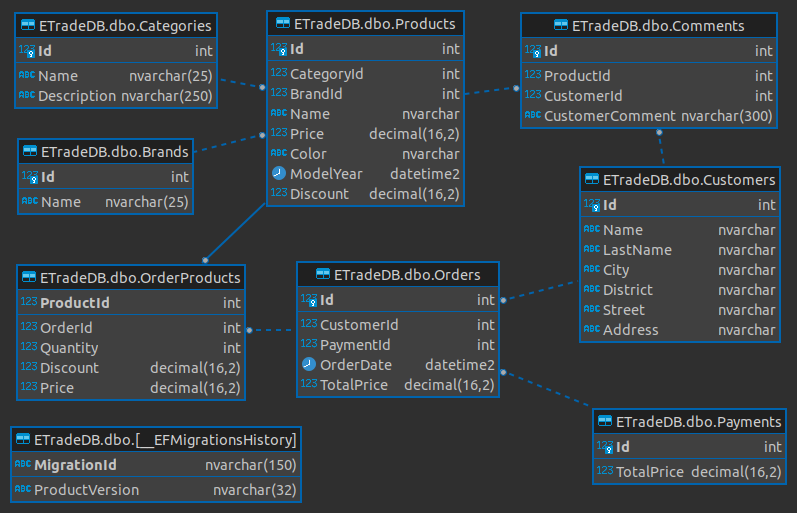
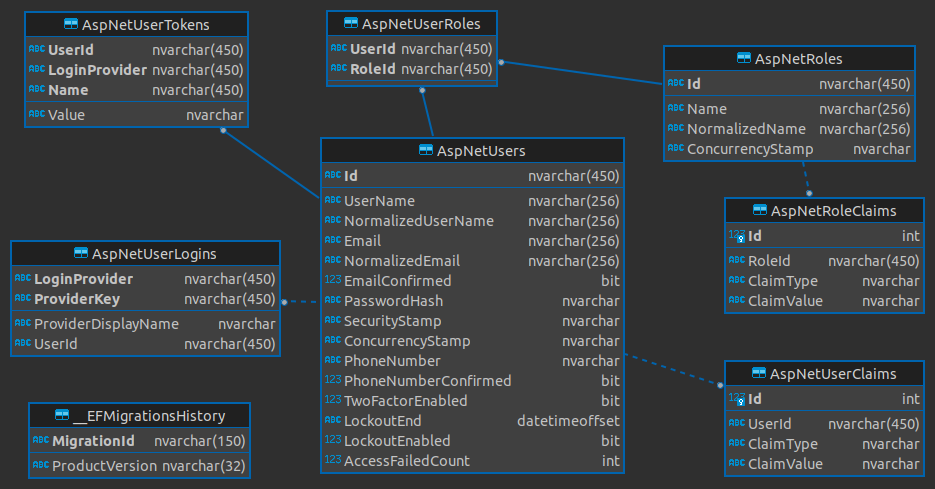

# ETrade-Project

## Proje Hakkında Bilgi

* Projede kullanılması için 14333 portunda bir MsSql imajı ile Docker container ayağa kaldırılmıştır ve proje esnasında kullanılmıştır.
* Projede ilerleyen süreçlerde başka clientlarda kullanabilme ihtimaline karşı bütün backend projesinin tekrar yazılmaması için Asp.Net Core WebApi projesi oluşturularak Web katmanının Api ile haberleşmesi sağlanmıştır.
* Projede bütün api metotları güvenlik için DTO nesneleri ile request ve response işlemelerini gerçekleştirmektedir. Bu işlem için AutoMapper kütüphanesi kullanılmıştır.
* Projede Asp.Net Core Identity yapısı kullanılarak cookie bazlı doğrulma ile yapılmıştır.
* Entity konfigürasyonu Fluent Api ile yapılmıştır.
* Repository Design Pattern, UnitOfWork Design Pattern gibi design patternler proje içerisinde kullanılmıştır.
* Dependency Injection için AutoFac kütüphanesi kullanılmıştır.

## Database Şeması



## Identity Database Şeması



## Connection String

Database'e bağlanmak için gereken connection string içinde yer alan kullanıcı adı ve şifre User-Secret ile oluşturulmuştur.

`dotnet user-secrets init`

`dotnet user-secrets set "uid" "sa"`

`dotnet user-secrets set "Password" "p55w0rd!"`

```json

{
  "UserId": "sa",
  "Password": "p55w0rd!"
}

```

## Database migration işlemleri

Migrations Ekleme

`dotnet ef migrations add "InitialCreate" --project ETrade.Repository/ --startup-project ETrade.API/`

Database Güncelleme

`dotnet ef database update --project ETrade.Repository/ --startup-project ETrade.API/`

## Api ile Kullanıcı Login İşlemleri

### Login İşleminde Kullanılan API'lar


### Login İşleminin Postman ile Test Edilmesi


### Login İşleminden Sonra Cookie Oluşması Testi


